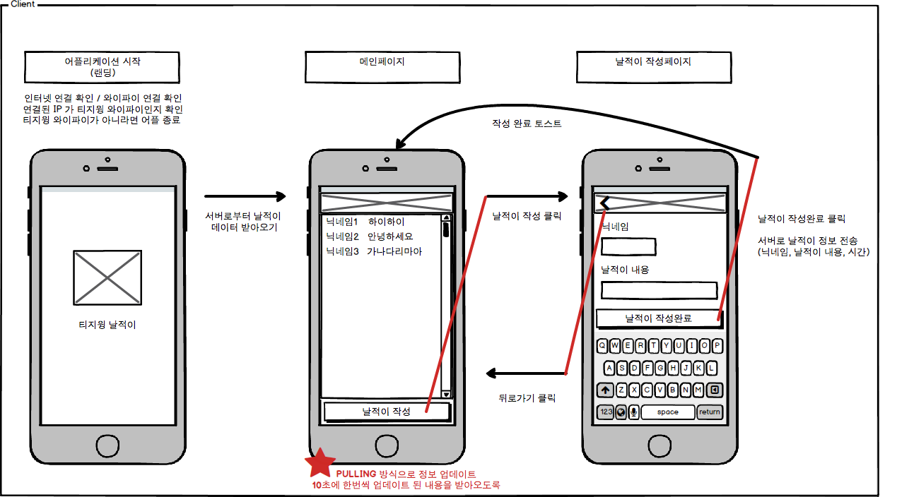

## 재학생 폴더

### T.G.WinG 날적이

- **Application Stack**
    - Server : Spring (java) + MySQL
    - Web : (미정)
    - Android : Java
    - iOS : swift

- **역할분담**
    - Server : 성준영, 김민호, 오종현, 윤승우
    - Web : 김성주, 황지원
    - Android : 안형준, 강세희, 오세준
    - iOS : 강태우, 김성주(sub)

- **따로 저장소를 만들지 않고, web, server, ios, android 등 폴더에서 프로젝트를 관리합니다.**

- 외부 라이브러리를 사용하는 경우, 의존성 관리 툴 (cocoapod / gradle / npm)을 필수로 사용하여 관리하며, 외부 소스를 .gitignore 에 등록하여 프로젝트 사이즈를 줄입니다.

- 참고
    - 
