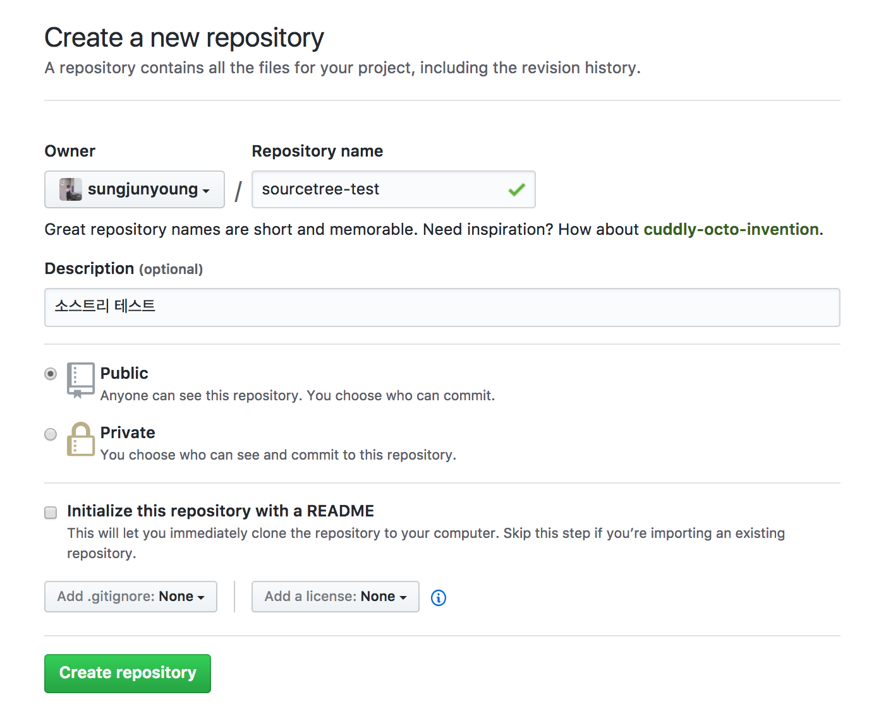
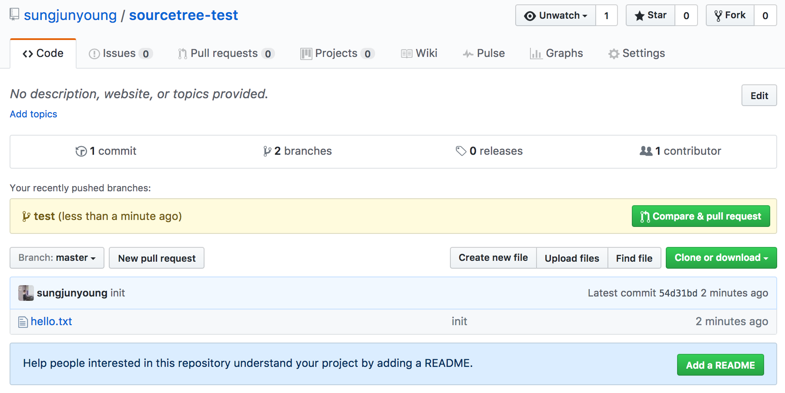

## 스터디 4주차

1. **GUI Tool : SourceTree**
    - Git bash 를 사용하지 않아보기
        - 토이 프로젝트 만들기
            - `<path>/sourcetree-test/hello.txt`
        - Sourcetree 에 프로젝트 등록시키기
            > `git init`

        - Sourcetree 에서 `hello.txt` 를 인덱싱 스테이지에 올리기
            >  `git add hello.txt`

        - Sourcetree 에서 커밋 메시지 작성 후 커밋하기
            > `git commit -m "<commit message>"`

        - Github 에서 토이 프로젝트 저장소 만들기
            > 

        - Sourcetree 에서 원격 저장소 등록하기
            > `git remote add origin https://github.com/<nickname>/sourcetree-test.git`

        - Sourcetree 에서 푸시하기
            > `git push origin master` / `git push`

        - Sourcetree 에서 `test` Branch 생성하기
            > `git branch test` && `git checkout test`

        - hello.txt 파일 내용 변경 후 `test` 브랜치에서 add/commit/push 하기

        - Github 에서 `README.md` 등록하기
            > 

            > 이후 commit new file 클릭

            > 원격 저정소의 마스터 브랜치 (origin/master)에 직접 등록한 것이며, 로컬 저장소에는 반영되있지 않음.

        - Sourcetree 에서 master 브랜치로 체크아웃하기
            > `git checkout master`

        - Sourcetree 에서 원격 저장소 master 브랜치를 pull 받기
            > `git pull origin master`

        - Sourcetree 에서 test 브랜치를 master 브랜치로 merge 시키기
            > *마스터 브랜치에서* `git merge test`

        - Sourcetree 의 히스토리 확인하기

        - Sourcetree 에서 원격 저장소로 push 하기

    - 결론
        - GUI 툴을 이용하는 것은 분명 편하지만, 내부적으로 어떤 동작에 의해 이루어지는 것인지 알아야한다.
        - 편해보이지만, 결국은 command line 이 편해지는 시점이 온다.

2. **신입생 프로젝트 관리 같이해보기**
3. **재학생 프로젝트 진행방향 결정하기**
